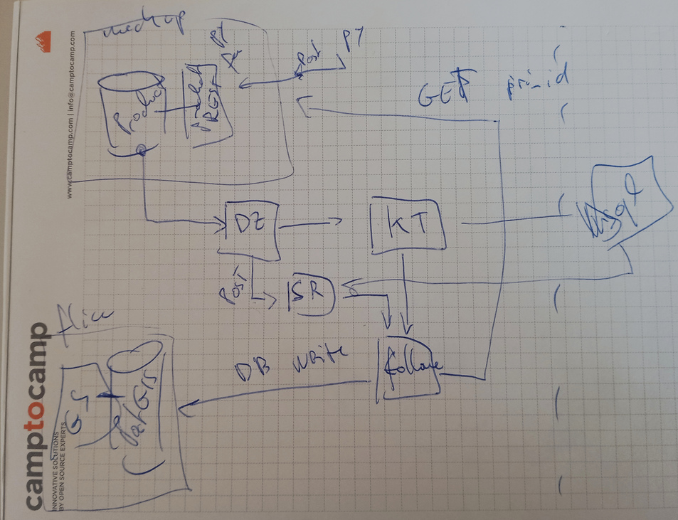

# A bit of R&D on kafka streams and debezium

The goal of the POC is to :

- write a line in a product database
- have Debezium emit the ID of the new object to kafka
- a follower takes this ID
- the follower makes a REST GET request on the product service
- it stores the point in a postgis database

we also use the confluent schema-registry for usage with Avro, and KSQLDB as QOL tool.

This poc is partially based on [this ksqldb tutorial](https://docs.ksqldb.io/en/latest/tutorials/event-driven-microservice/)

## How to run the POC

### configure kafka and product api mockup

1. `docker-compose up -d --build` this launches the services

2. setup debezium replication

   `curl -i -X POST -H "Accept:application/json" -H "Content-Type:application/json" localhost:8083/connectors/ -d @debezium/products-dz-config.json`

3. login into ksqldb-cli container and create the kafka stream (you must wait about one minute before doing this)
   `docker exec -it ksqldb-cli ksql http://ksqldb-server:8088`
   and copy-paste the SQL script from `./scripts/create_stream.sql` int the ksql shell

### Run the java application in intelliJ

first genereate the SerDes classes with the Avro schema : `mvn generate-sources`

then open IntelliJ, import the pom.xml and run `IsiSubscriber::main` from there

### create events (mockup)

run `./scripts/create_events.py`

## References

### debezium + postgis (pg v. 9.5)

https://github.com/52North/postgis-kafka-cdc/blob/master/postgis-debezium/Dockerfile

### debezium auto-create topics

https://debezium.io/blog/2020/09/15/debezium-auto-create-topics/

### SerDes avro, protobuf and json

https://docs.confluent.io/platform/current/schema-registry/serdes-develop/index.html

### commit async example

https://www.logicbig.com/tutorials/misc/kafka/kafka-manual-commit-async-example.html

### commit sync example

https://www.programcreek.com/java-api-examples/?class=org.apache.kafka.clients.consumer.KafkaConsumer&method=commitSync

### kafka config

offsets commit timeout
https://kafka.apache.org/documentation/#brokerconfigs_offsets.commit.timeout.ms
